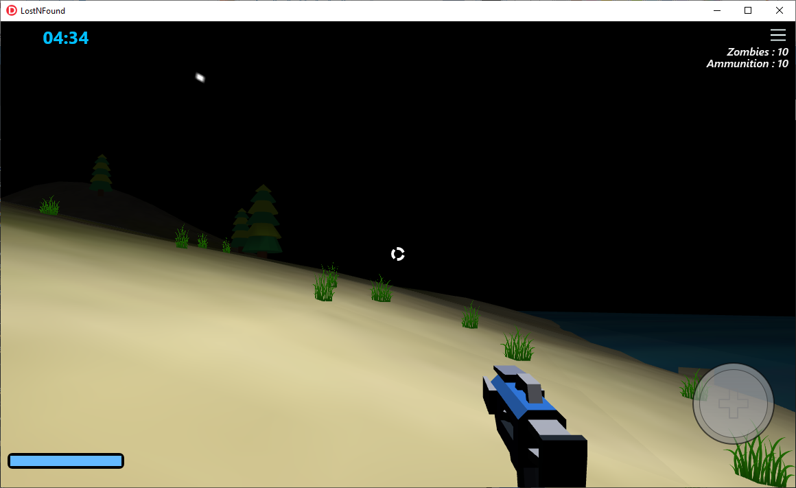
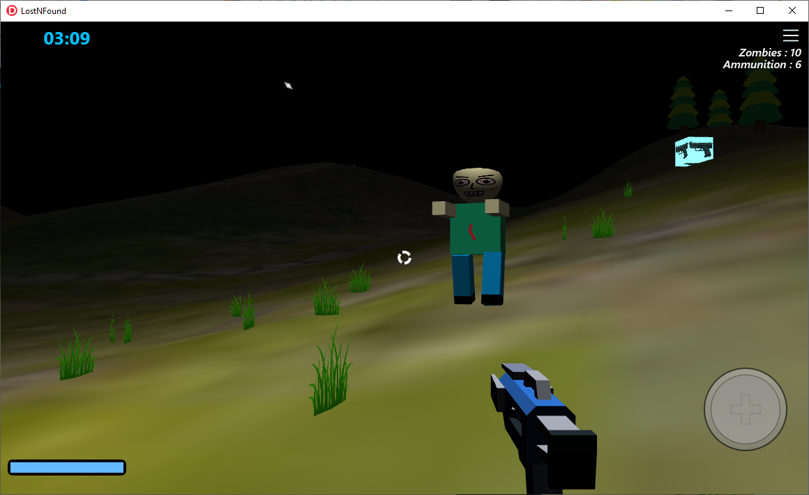
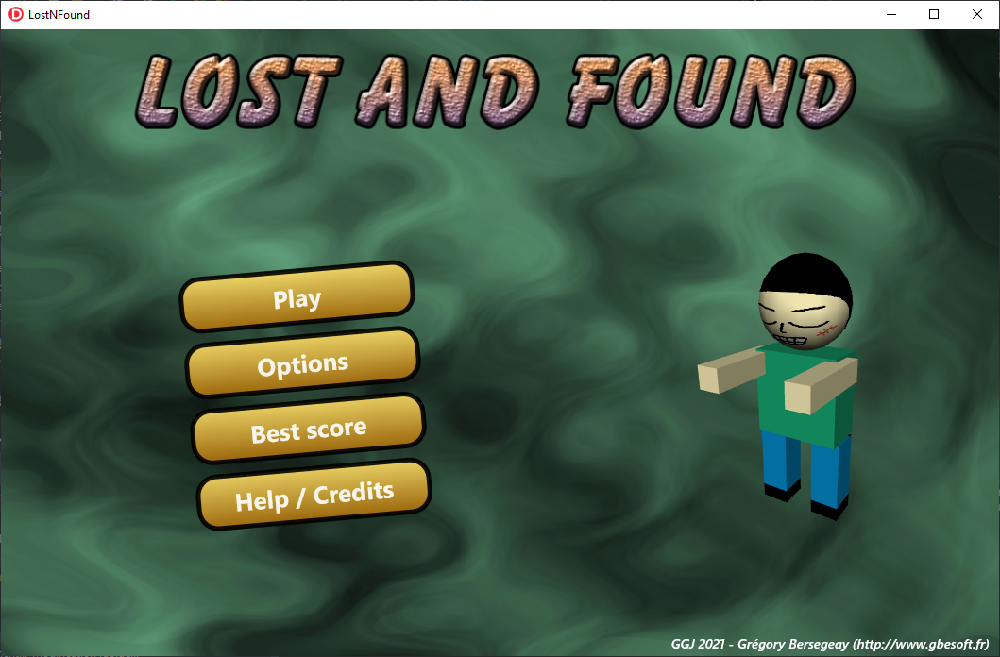

# LostNFound

Ma contribution à la Global Game Jam 2021 (https://globalgamejam.org/2021/games/lostnfound-5).

Vous devez installer les composants GBE3D (https://github.com/gbegreg/GBE3D) pour compiler ce projet.

Vous trouverez l'exécutable (et les musiques et les sons) sous 

A noter : par défaut, le jeu est paramétré avec un clavier AZERTY. Vous pouvez configurer le clavier en QWERTY dans les options.

 
 
 
 
